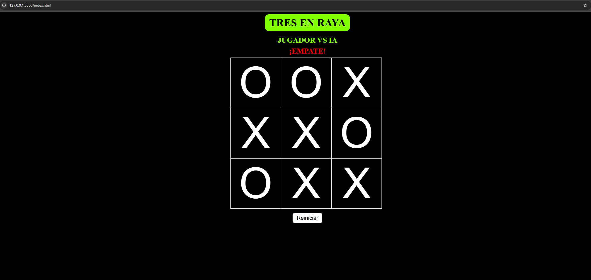

# Tres en Raya —  Manual de Usuario

## Índice

- [Tres en Raya —  Manual de Usuario](#tres-en-raya---manual-de-usuario)
  - [Índice](#índice)
  - [Descripción](#descripción)
  - [Características](#características)
  - [Modos de juego](#modos-de-juego)
    - [1) Jugador vs Jugador (local)](#1-jugador-vs-jugador-local)
    - [2) Jugador vs IA](#2-jugador-vs-ia)
  - [Cómo se juega](#cómo-se-juega)
    - [El tablero](#el-tablero)
    - [Turnos](#turnos)
    - [Realizar una jugada](#realizar-una-jugada)
  - [Fin de la partida](#fin-de-la-partida)
    - [✅ Victoria](#-victoria)
    - [🤝 Empate](#-empate)
    - [❌ Derrota (modo vs IA)](#-derrota-modo-vs-ia)
  - [Reiniciar partida](#reiniciar-partida)
  - [IA: cómo funciona](#ia-cómo-funciona)
  - [Instalación y ejecución](#instalación-y-ejecución)

---

## Descripción

**Tres en Raya** (también conocido como _Tic-Tac-Toe_) es un juego para dos jugadores que se turnan para colocar **X** y **O** en un tablero de **3×3**.  
El objetivo es **alinear tres símbolos** en **fila**, **columna** o **diagonal** antes que el oponente.

---

## Características

- 🎮 **2 modos**: Jugador vs Jugador (local) y Jugador vs IA.  
- 🧠 **IA** con lógica de ataque/defensa (gana, bloquea y, si no procede, mueve al azar).  
- ✨ **Interfaz clara**: indicador de turno y mensajes de resultado.  
- 🔁 **Reinicio inmediato** de partida.  
- 🧩 **Validación de jugadas**: no permite colocar sobre casillas ocupadas.  
- 📱 Pensado para ser **sencillo y directo** (ideal para empezar/enseñar).

---

## Modos de juego

### 1) Jugador vs Jugador (local)
- Se juega en el **mismo dispositivo/teclado/ratón**.
- **Empieza X (Jugador 1)** y luego **O (Jugador 2)**, alternando turnos.
- Gana quien alinee tres de sus símbolos.

### 2) Jugador vs IA
- Puedes **elegir quién empieza** (o dejarlo **aleatorio**).
- El **jugador que empieza** usa **X**; el oponente (humano o IA) usa **O**.
- La **IA** intenta ganar y, si no puede, **bloquea** tus amenazas.  
  Cuando no hay jugadas “críticas”, realiza una **jugada aleatoria válida**.

---

## Cómo se juega

### El tablero
- Una cuadrícula de **9 casillas (3×3)**.
- Al inicio, todas las casillas están **vacías** y son **clicables** (o tocables).

### Turnos
- Siempre hay **un único movimiento por turno**.
- Verás un **mensaje** indicando el turno:  
  - `Turno: Jugador 1 (X)`  
  - `Turno: Jugador 2 (O)`  
  - `Turno: IA`

### Realizar una jugada
1. **Haz clic** (o toca) una **casilla vacía**.  
2. Aparecerá tu símbolo (**X** u **O**).  
3. El turno pasa al otro jugador / a la **IA**.

> **Regla clave:** No puedes jugar en una **casilla ya ocupada**.

---

## Fin de la partida

La partida termina cuando ocurre **uno** de estos casos:

### ✅ Victoria
- Alineas **tres símbolos** (fila, columna o diagonal).  
- Se muestra **“¡GANADOR!”** junto al nombre del vencedor y se **resaltan** las casillas.

### 🤝 Empate
- **Todas** las casillas están ocupadas **sin** tres en línea.  
- Se muestra **“¡EMPATE!”** (normalmente en **rojo**).

### ❌ Derrota (modo vs IA)
- La **IA** alinea tres antes que tú.  
- Verás el mensaje **“Derrota: más suerte la próxima”** (en **rojo**).

---

## Reiniciar partida

Tras cualquier resultado, puedes pulsar **Reiniciar**:

- 🧹 **Limpia** el tablero (todas las casillas vacías).  
- 🔙 **Restablece** las opciones de modo de juego.  
- 📨 **Oculta** el mensaje de resultado.  
- 🆕 Vuelves al **estado inicial**.

---

## IA: cómo funciona

La IA evalúa el tablero en este **orden de prioridades**:

1. **Jugada ganadora**  
   - Si puede alinear tres con su siguiente movimiento, **lo hace**.
2. **Bloqueo**  
   - Si el jugador humano amenaza con ganar (tiene **dos en línea** y una casilla libre), **bloquea** esa casilla.
3. **Movimiento por defecto**  
   - Si no hay jugadas decisivas, **elige aleatoriamente** una casilla vacía.

---

## Instalación y ejecución

1. Clona/descarga el repositorio.  
2. Abre `index.html` en tu navegador.

